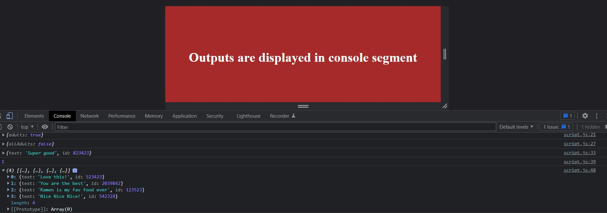

<h1 align="center">DAY 7 Of #JavaScript30 - "7 Array Cardio Day 2"</h1>
 

  

<h3>In this Challenge I learned how to use some array prototypes like <i>some, every, find, findIndex, splice</i></h3>
