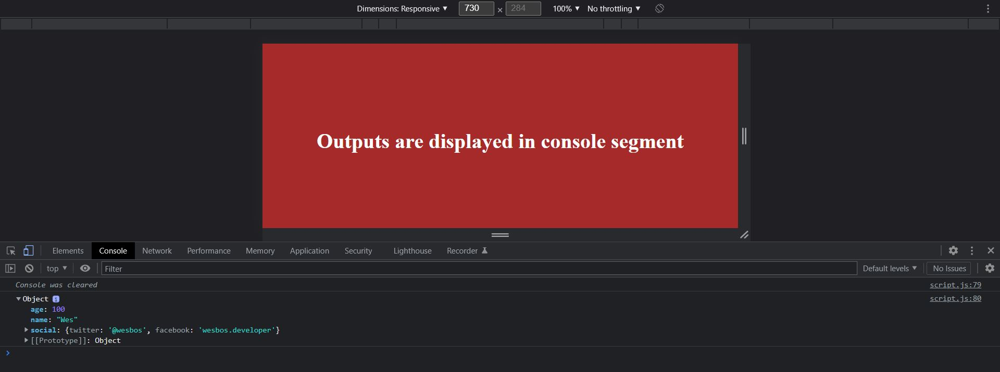

<h1 align="center">DAY 14 Of #JavaScript30 - "Reference VS Copy"</h1>
 

  

<h3> Today I learned how to refer and use the values as well as how to copy the values without affecting the predefined values using JS</h3>
