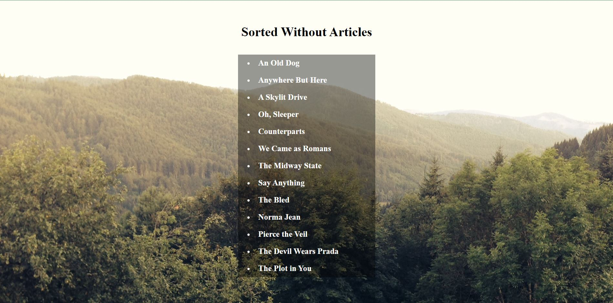

<h1 align="center">DAY 17 Of #JavaScript30 - "Sorting Without Articles"</h1>
 

  

<h3> Today I learned how to Ignore the unwanted part of the data (here its articles) and sorting them, and inserting the sorted datas into the HTML using JS</h3>
